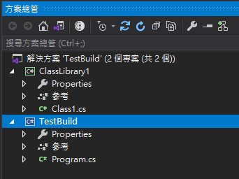
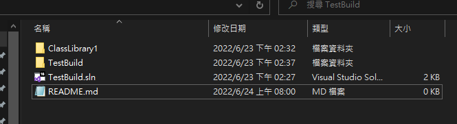
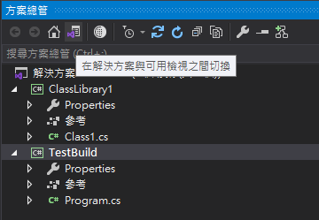
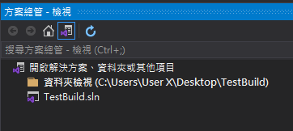
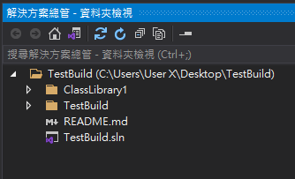
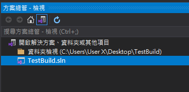

# Visual Studio 在解決方案與可用檢視之間切換

一般來說，Visual Studio 方案總管可以看到的專案結構，如下圖 1 所示：

圖 1、方案總管專案結構

如果我們要去這些專案以外的資料夾進行編輯，一般的作法是，把該專案底下的資料夾叫出來，然後找到該檔案進行編輯，例如：要編輯專案的 README.md 檔案，但是，該檔案位於與 sln 檔案同一目錄中；一般就是開啟資料夾，然後打開編輯，如下圖 2 所示：

圖 2、檔案在 sln 檔案同一目錄底下

這就導致如果要編輯 REAMME.md 檔案，就要在 Visual Studio 與該目錄之間做切換，然後還要另外開啟編輯器進行編輯，很沒有效率。其實在 Visual Studio 的方案總管中，有一個在解決方案與可用檢視之間切換的按鈕，如下圖 3 所示：

圖 3、在解決方案與可用檢視之間切換

點擊下去之後，可以看到方案總管的檢視變得不一樣了，分為兩種，資料夾檢視，以及解決方案檔，如下圖 4 所示：

圖4、方案總管-檢視

點選資料夾檢視，可以看到與完整的資料夾，可找到剛剛的 REAMME.md 檔案，如下圖 5所示：

圖 5、解決方案總管 -- 資料夾檢視

如果想要再還原回原本的專案結構檢視，可以點選 sln 檔案，就可以在切換回去，如下圖 6 所示：

圖6、點選 TestBuild.sln 回復原本專案結構檢視
