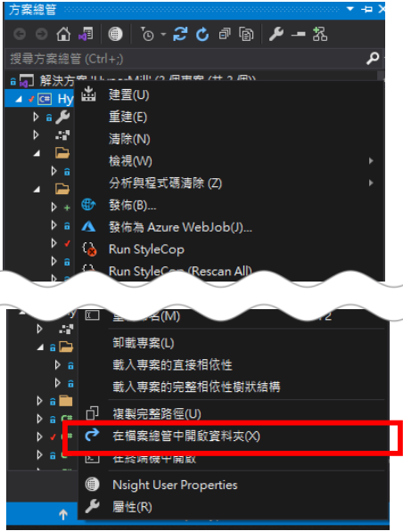
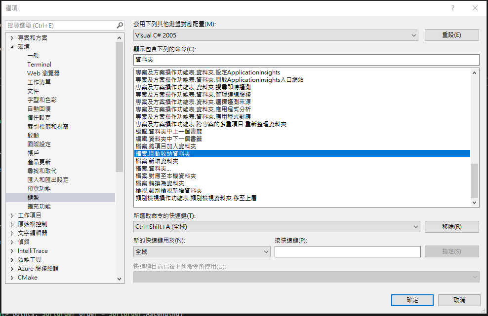

# Visual Studio 快速開啟檔案所在的資料夾

使用 Visual Studio 開發程式的時候，要開啟正在編輯中的檔案的資料夾，都是透過在方案總管中點擊右鍵，在檔案總管中開啟資料夾的方式，如下圖 1 所示：

圖 1、在檔案總管中開啟資料夾

開啟專案所在資料夾之後，再去尋找該檔案的位置，都要花費一番功夫，且步驟比較繁瑣一點。目前發現可以設定快捷鍵的方式，迅速開啟該檔案的資料夾；從 Visual Studio 上面的選單中，工具 -> 選項 -> 鍵盤，找到"鍵盤.開啟收納資料夾"的選項，並且自定義快捷鍵，如下圖 2 所示：

圖 2、開啟收納資料夾
