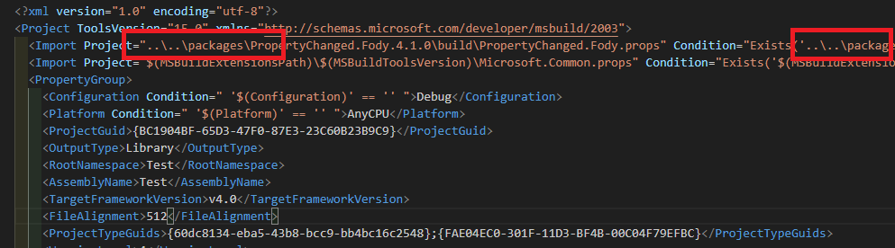

# Visual Studio 編譯錯誤：此專案參考這部電腦上所缺少的 NuGet 封裝

在幫專案進行資料夾分類的時候，當分類完成要進行編譯的時候出現以下錯誤資訊，

**此專案參考這部電腦上所缺少的 NuGet 封裝。請啟用
NuGet 封裝還原，以下載該封裝。如需詳細資訊，請參閱 http://go.microsoft.com/fwlink/?LinkID=322105。缺少的檔案是....**

不論我如何清理重建方案，一直都是失敗的，然後點開專案的管理 NuGet 套件的頁面，確定裡面的套件都是有安裝好的，無論如何使用就是無法順利編譯，一直呈現這個錯誤，最後發現，由於我的專案位置原本跟 packages 資料夾是在同一層的，但是因為我將專案資料夾又多移動到一層資料夾裡面，導致原本 csproj 裡面的路徑，還是原本的 packages 資料夾路徑，以至於無法找到對應的 packages 資料夾路徑才會呈現此錯誤。

因此，只需要打開專案的 csproj 檔案，將 packages 裡面路徑的地方，多加上 ../ 給他多上一一層，就能夠順利找到 packages 資料夾了，畫面如下圖 1 所示：

圖 1、修正參考到的 packages 路徑

重點就是 packages 資料夾的路徑要相對於專案檔案 csproj 檔案路徑，只要路徑正確找得到就可以順利排除此問題了。
