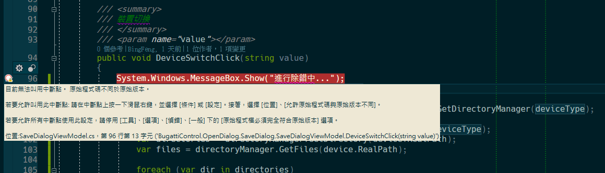
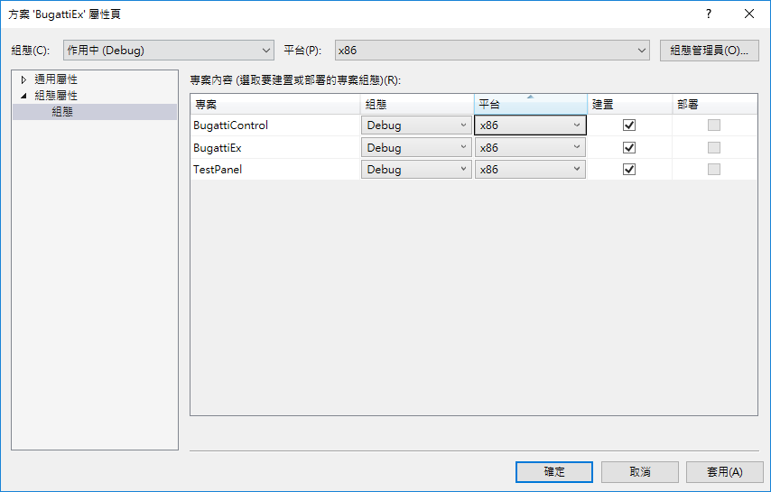
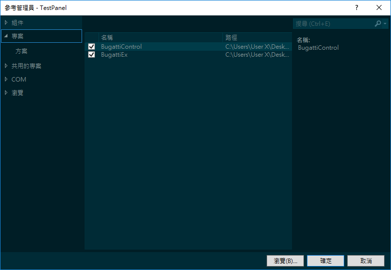

# 解決 Visual Studio 無法進入Debug模式中斷點的問題

最近在使用 Visual Studio
撰寫程式時，發生在除錯模式下無法進入中斷點的情況，找了一下原因發現每次程式進行除錯模式時，其執行的程式都不是執行修改過後的程式碼，而是一直去執行程式修改之前的程式碼，這個狀況就是當前版本與當前程式碼不相符，如下圖1所示，之前碰到此類問題時，通常都是先將專案清除，然後再到專案下的
obj
資料夾內，將裡面的檔案全部刪除，之後重新編譯專案即可，但是此次按照上述步驟操作過後，的確可以進入中斷點，但是在進行程式碼編輯過後，又跑回去執行編輯前的程式碼，導致又出現下圖1的情況。

圖1、原始程式碼不同於原始版本

嘗試重啟 Visual Studio
與重開機之後，還是一直無法進入程式修改過後的中斷點，因此，從專案的屬性下手，下圖2為專案組態配置，因為之前的專案模式是使用
Any CPU，可是過程中因為程式需要將專案轉成 x86 模式，因此測試將 x86
模式的專案轉成 Any CPU後，發現竟然可以順利的進行偵錯，然後再確認一次 x86
模式，發現第一次執行時可順利進入中斷點，在進行程式碼編輯過後，又無法進入中斷點了，確認是組態的問題過後，就將專案重新參考的配置，如下圖3所示，發現這個問題就排除了，猜測會有此問題的發生應該是，專案在執行時，一直參考的是
Any CPU 的 dll，而不是 x86 的 dll ，才導致 Visual Studio 一直去執行
AnyCPU 的程式碼，因此將專案切換成 x86
模式後，在進行重新的專案參考，就可以順利的進行中斷點的偵錯了。

圖2、專案組態

圖3、重新加入專案參考
