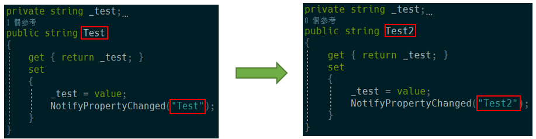
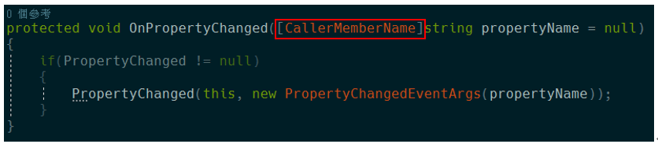
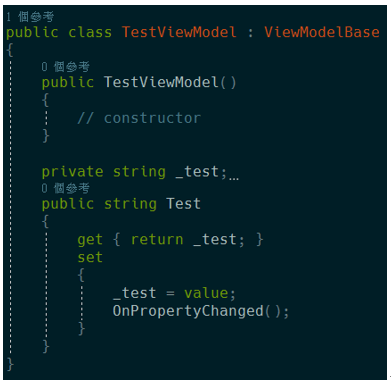
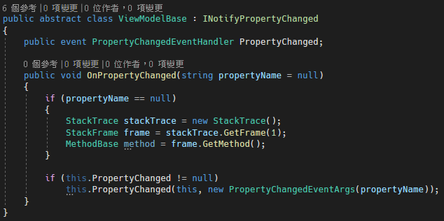
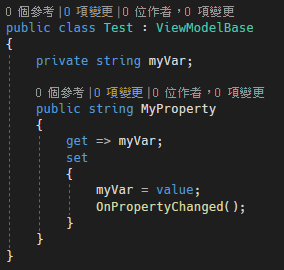
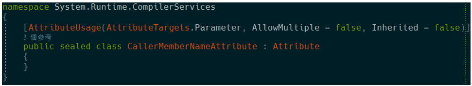
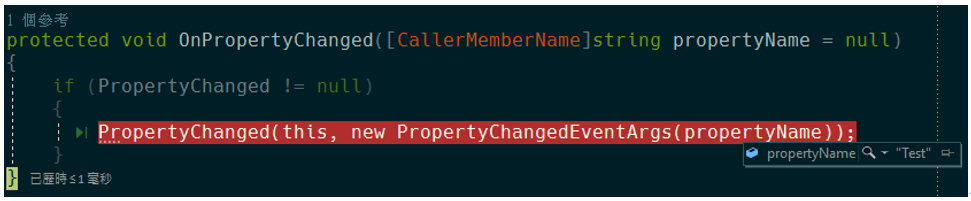

**WPF Binding 通知屬性變更的簡化寫法 (2)**

本文主要目的為簡化 NotifyPropertyChanged
每次通知屬性變更都要告知屬性名稱的問題。在前一段時間有介紹如何不需告知屬性名稱的撰寫方法，而本篇為上一篇的簡化版，使用更少的程式碼達到同樣的目的。

首先說明一下，每次都要告知屬性名稱會有甚麼問題，就是每當屬性的變數名稱做了修改，就需要在呼叫
NotifyPropertyChanged 的地方都要再修改一次，如下圖所示：

顯然這樣子的寫法是相當不好的，因為可能在修改的過程中，忘記去修改
NotifyPropertyChanged 裡面的 string
名稱，導致在除錯的過程就相當的不易，因此才會想知道有沒有什麼辦法可以不用寫名稱，在第一篇中有介紹一個寫法，可以不用撰寫通知屬性，不用寫通知屬性時，不只更加方便，程式也比較穩固如下圖所示：

透過 CallerMemberName 的Attribute
標籤，自動去尋找呼叫此方法所在的屬性區塊，藉此找到屬性名稱，但很不幸的是\[CallerMemberName\]的這個特性，只有支援.Net
4.5那現在怎麼辦呢?
所以在前一篇有介紹改寫成以下程式碼寫法，來支援我們所需的功能，如下程式碼所示：

在最近又發現有更加簡便的寫法，來使我們的程式碼可以支援
CallerMemberNameAttribute
的寫法，就如剛剛所說，CallerMemberNameAttribute只在 .NET Framework 4.5
中支援，那要怎麼辦呢?

首先，可透過騙過 Compiler 的方式，讓他以為我們有這個屬性，來達到使用
CallerMemberNameAttribute
的特性，相當特別的寫法，特別注意，此寫法僅支援C#5.0以上才可支援，程式碼如下所示：

當我們完成時，測試一下發現真的可以找到對應的屬性名稱，如下圖所示：

透過這樣特殊的寫法，就讓我們擁有 .NET 4.5 才支援的功能。

**參考文獻：**

https://www.thomaslevesque.com/2012/06/13/using-c-5-caller-info-attributes-when-targeting-earlier-versions-of-the-net-framework/
