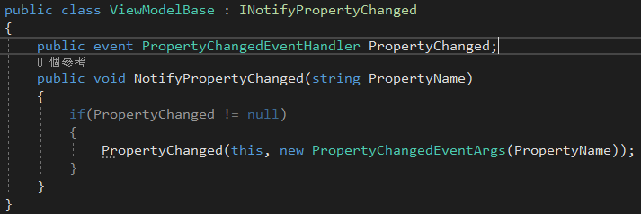
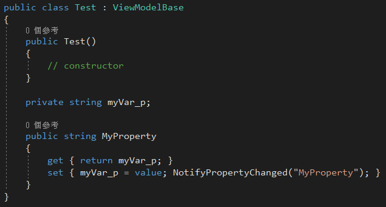
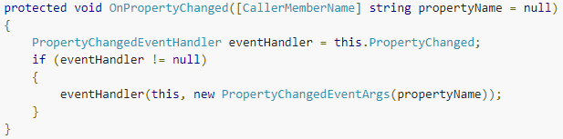
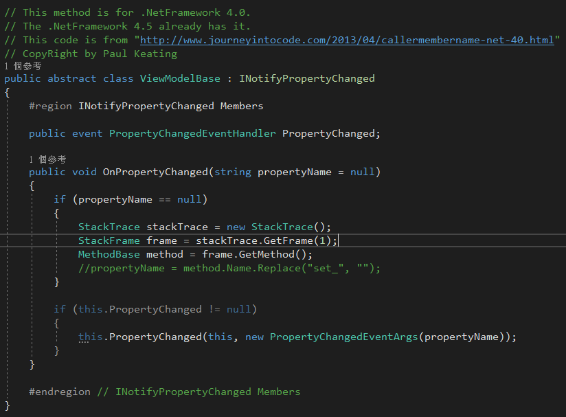
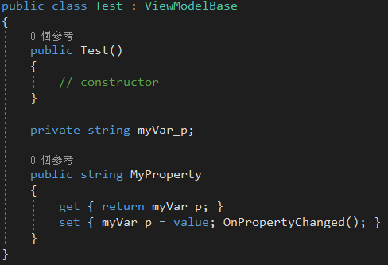

# WPF Binding通知屬性變更的簡化寫法

本篇主要的目的為簡化NotifyPropertyChanged每次通知屬性都要告知屬性名稱的問題，在WPF中我們想要讓WPF達到Binding的功能通常需要實現INotifyPropertyChanged，並且實作裡面的介面，如下圖所示：

上面的實作出來後，我們繼承剛剛的ViewModelBase就可以使用開始寫屬性，屬性寫好之後，當有改變我們就透過NotifyPropertyChanged通知屬性有做改變，但可以從下面看到每次NotifyPropertyChanged我們都要寫一次要通知的屬性名稱如"MyProperty"，這樣的寫法會有什麼問題呢?這樣子寫不會有任何問題，只是我們在寫的時候，如果有很多屬性的時候，通常我們都要寫很多次屬性名稱，以我們現在這麼懶惰的個性有沒有什麼辦法可以不要寫屬性名稱出來呢?

根據上面的問題，.Net4.5剛好有支援，剛好網路上有看到一個寫法，可以讓我們不用再多寫一次屬性名稱，如下圖所示，在string
propertyName的前面加上\[CallerMemberName\]的特性，往後我們在做屬性通知的時候可以直接OnPropertyChanged()，他就會自動地去對應到屬性名稱，就不用再特地的寫出要通知的屬性是誰。

這樣我們就完美解決目前我們所遇到的問題了嗎?答案是並沒有，因為我們在開發的時候主要使用的平台為.Net4.0，而剛好\[CallerMemberName\]的這個特性，只有支援.Net
4.5那現在怎麼辦呢?網路上Paul
Keating大大好心的有提供一個方法可以讓我們達到.Net4.5的效果，只需以下圖的方法實作INotifyPropertyChanged，我們的問題就解決了。

繼承剛剛所寫的ViewModelBase抽象，我們的屬性就能夠達到通知屬性變更的效果了，而且只需要寫OnPropertyChanged()，不用指定屬性名稱，這樣的寫法將會大大的縮短我們的開發時間，也不用害怕所通知錯誤屬性名稱，或是把屬性名稱寫錯。

