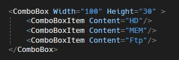
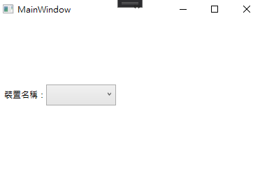
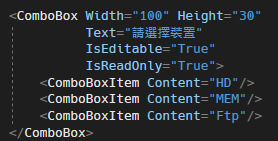

# WPF ComboBox Placeholder 預設文字

在 WPF 中，如果想要再項目還未被選擇時，有一個提醒文字 (PlaceHolder)
顯示要怎麼辦呢? 因為在 WPF 中 ComboBox 元件中並沒有 PlaceHolder
的屬性可以設定。通常會有兩種做法，第一種是自己設計一個 Style
然後再添加到一個地方在還未選取項目時，觸發屬性讓 PlaceHolder
顯示出來，第二種，為本篇主要介紹的方法，此方法叫第一種方法簡單很多，但是如果要自訂樣式的話，還是建議使用第一種方法去呈現。

先來看看一般的 ComboBox，可看到設定完 ComboBox
之後，剛開始顯示時，ComboBox
的內容是空白的，這樣對於提醒使用者來說少了一點提醒，如下圖 1 所示：

圖 1、原始 ComboBox

接下來將 ComboBox 加上 PlaceHolder，只要在 ComboBox 的屬性中，加上 text
為你想要呈現的文字，並且設定 IsEditable 為 true 以及 IsReadOnly 為 true
，就可以在畫面中看到，設定的預設文字了，如下圖 2 所示：

圖2、加入 PlaceHolder
