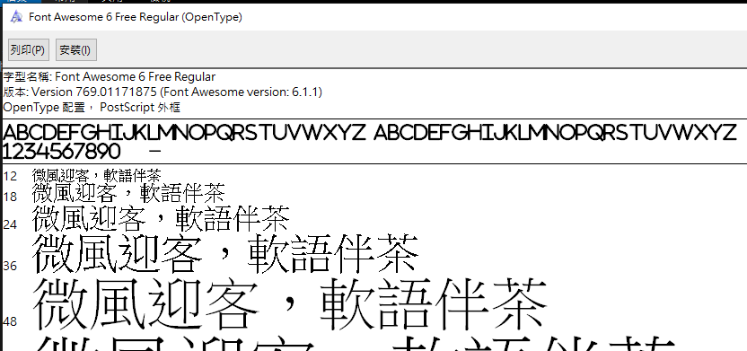

# WPF FontAwesome 如何知道引入的字串

從 FontAwesome
官網下載檔案之後，如何引入正確的路徑很重要，之前都是看網路上面的範例知道按照這樣打就能夠使用，並不知道他實際上是如何運作的。

首先看一下 FontAwesome 路徑引用

\<FontFamily
x:Key=\"FontAwesome\"\>/Fonts/fontawesome-webfont.ttf#FontAwesome\</FontFamily\>

把下載好的檔案放到指定的位置之後，在裡面使用 FontFamily
指定路徑，指定道路徑之後，我要怎麼知道 \# 後面是要放甚麼?

此時，找到該 .ttf 的檔案，對他點擊右鍵預覽，如下圖 1 所示：

圖 1、FontAwesome 字形樣式預覽

可以看到字形名稱，就是那個名稱，複製到 \# 後面就能正常使用了

https://stackoverflow.com/questions/38305239/how-use-icon-font-awesome-in-wpf
