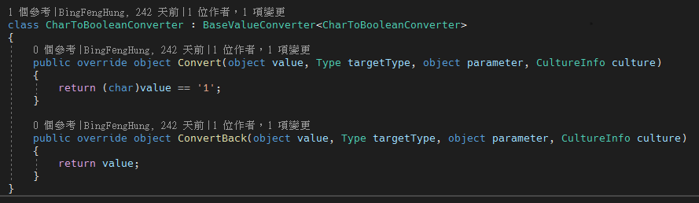

# WPF IValueConverter 裡面的 ConvertBack 函式說明

通常我們在將 XAML 中綁定的某個值進行轉換，會透過 Converter 的方式，要使用 Converter 必須要有繼承至 IValueConverter 的介面，這個介面需要實作兩個方法，Convert() 與 ConvertBack()；通常我一般只有使用 Convert 方法將綁定的數值轉為另外一個值回傳，很少使用到 ConvertBack 方法。由於最近碰到需要使用 ConvertBack 的場景，因此，特別紀錄一下使用方式。

範例如下，我有一個 CheckBox，因為這個 CheckBox 的值是從資料庫取得，資料庫取出來的是字元 1 與 0；1 代表 true，0 代表 false，因此寫了一個 IValueConverter 的類別，綁訂到 CheckBox 的 IsCheck 屬性上面，如下圖 1 所示：

圖 1、設定 Converter 類別進行綁定值的轉換

在 Convert 函式的地方，可以很清楚的知道他是判斷傳入的值是否是 '1'，是的話回傳 true，目前 CheckBox 可以根據資料屬性，判斷他要不要 IsCheck，接下來碰到回存到資料庫的問題了，當我去將 CheckBox 的勾勾取消的時候，並沒有真正將綁定的資料設定為 0，此時根據經驗，要設定 TwoWay Binding，如下圖 2 所示：

圖 2、設定 TwoWay Binding

加上去之後，發現還是沒有將 CodeBehind 的資料設定為 0，還是一直保持為 1，經過研究之後，發現原來問題出在 ConvertBack 這個函式，因為我上面是寫直接回傳 value，不過這個 value 的實際值為布林值，根本不是我要的字元，所以導致無法寫回正確的值給 CodeBehind 的資料，因此，調整 ConvertBack 函式，如下圖 3 所示：

圖 3、ConvertBack 函式實作

修改完成之後，就能夠在畫面點選 CheckBox 時，勾選或是取消勾選，都能修改到 CodeBehind 的屬性了。
