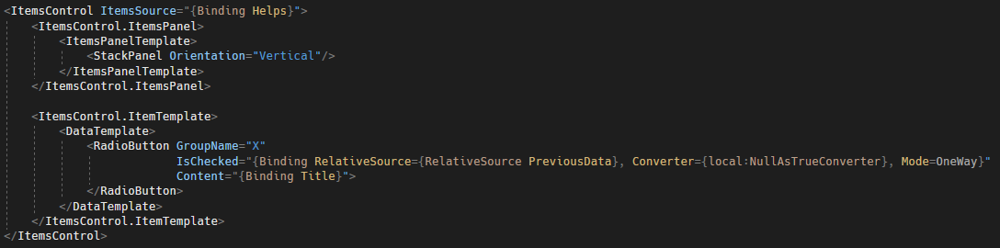
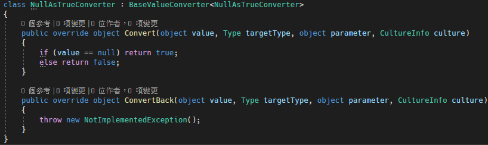

# WPF ItemsControl 中的 RadioButton 預設第一個項目是被選取的狀態

ItemsControl 可以產生一系列集合的項目，假設今天有一個選單列表，是使用
RadioButton
來控制目前選到的項目，目前的問題是，當想要一進入畫面時，讓第一個項目預設是被選擇的，可以使用以下的方式來達到。

在 RadioButton 的 IsChecked 屬性綁定 RelativeSource 為
PreviousData，表示說，他會去找前面的資料，第一筆資料的前一筆資料是空的
(null)，根據這個條件，建立一個 NullAsTrueConverter，當綁定的資料是 null
的時候，回傳 True，這樣第一個 RadioButton 的 IsChecked 屬性值就會是
True，程式碼如下圖 1 所示：

圖1、檢查 PreviousData 是否為 null

NullAsTrueConverter 用來判斷當前所綁定的資料是否為空值，如果是的話，回傳
true，不是的話回傳 false，程式碼如下圖 2 所示：

圖 2、NullAsTrueConverter
