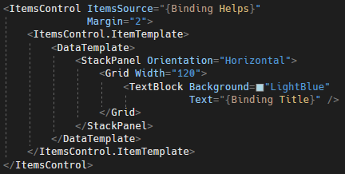
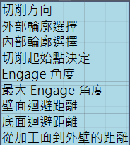
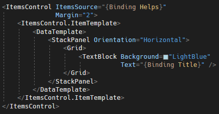
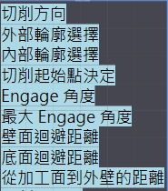
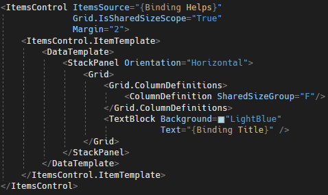
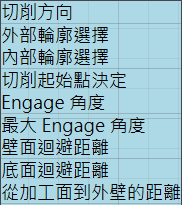

# WPF ItemsControl 內容元素同寬設定

在使用 ItemsControl 時，通常會想要讓裡面的元素寬度一樣，常見的做法是找出最長的元素，然後再上面指定最寬元素的寬度到
DataTemplate 裡的包裝容器中，但是直接用 Hard-code
寫死，並不是一個好方法，如下所示：

圖 1、直接指定寬度值的方式

最好的做法是，不要指定寬度，讓元素自行根據他的內容來計算他應該要多寬。但是，又回到原本的問題，如果
ItemsControl
的每個元素都根據自己的內容調整大小，所有元素的寬度並不會相等，如下圖 2
所示。

圖 2、讓元素長度自行根據內容調整寬度

為了解決此問題，將使用 Grid 一個不常用的功能；Grid 中有一個附加屬性
IsSharedSizeScope，將這個屬性附加在 ItemsControl 上面並設定為
True。然後再 ItemsControl 的 ItemTemplate 中加入一個 Grid
，將想要同寬的元素包進去，並定義 Grid 的 ColumnDefinition ，將
SharedSizeGroup 屬性設定為任意識別項 (群組識別項) 即可，程式碼如下所示：

圖 3、使用 Grid.IsHaredSizeScope
