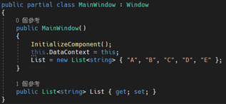
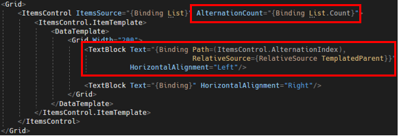
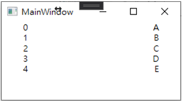

# WPF ItemsControl 顯示編號的做法

在呈現一系列資料的時候，會使用 ItemsControl，將項目依序顯示在畫面上，顯示在畫面上的資料有時候會需要顯示編號，從編號 1 號開始顯示到項目的總數量；之前，在處裡這種做法的時候，都是習慣在 Model 類別中額外定義一個 index 的變數，透過綁定這個變數的方式將資料呈現出來，本篇將介紹另外一種作法，不需要額外在 Model 類別中額外在定義 index 變數。

這邊需要使用 ItemsControl 的屬性，AlternationCount 與 ItemsControl.AlternationIndex 這兩個屬性，裡面的 AlternationCount 主要用來設定裡面的總項目總共有幾個，AlternationIndex，就是索引值，從 0 開始。

這邊先用簡單的定義 List 的變數值，程式碼如下圖 1 所示：

圖 1、List 宣告

接下來到 MainWindow.xaml 檔案的地方，撰寫我們的程式碼，程式碼如下圖 2 所示：

圖 2、ItemsControl 資料綁定

畫面呈現如下圖 3 所示：

圖 3、程式畫面

### 參考資料：
https://blog.csdn.net/sdfjasad/article/details/121229187
