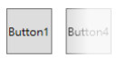

# WPF OpacityMask 透明漸層效果設定
## 前言
在 WPF 中要讓控制項有透明的效果通常是使用 Opacity 的屬性，設定 0 ~ 1 之間的值，可以讓控制項達到不同的透明效果。但是，這個無法做出有漸層透明的效果；WPF 控制項中有一個 OpacityMask 的屬性，會在控制項的上方有一個遮罩，讓我們可以自訂要如何透明漸層的感覺，這與 Opacity 使控制項本身實現透明效果是不同的。

為此，本篇旨在說明 OpacityMask 的使用概念，以利建立自己所需的透明漸層效果。

## Opacity 屬性

首先 Opacity 屬性讓所有的控制項內容都變成透明的，程式碼如下所示：

```xml
<StackPanel Orientation="Horizontal" HorizontalAlignment="Center">
  <Button Content="Button1"
          Width="50" Height="50"
          Margin="15"/>

  <Button Content="Button2"
          Width="50" Height="50"
          Opacity="0.3" />
</StackPanel>
```

控制項內容都變透明的，如下圖 1 所示：


圖 1、控制項透明化

## OpacityMask
再來介紹 OpacityMask，這邊有一個很重要的一點 OpacityMask 屬性接受任何的 Brush，但是他會吃 Brush 的 alpha 值，例如 #7F111122，前面的 7F 就是 alpha 值，後面的 RGB 是不會看的，程式碼如下所示：

```xml
<StackPanel Orientation="Horizontal" HorizontalAlignment="Center">
  <Button Content="Button1"
          Width="50" Height="50"
          Margin="15"/>

  <Button Content="Button3"
          Width="50" Height="50"
          Margin="15">
      <Button.OpacityMask>
         <SolidColorBrush Color="#7F111122"/>
      </Button.OpacityMask>
  </Button>
</StackPanel>
```

控制項內容都變透明的，如下圖 2 所示：


圖 2、OpacityMask SolidBrushColor Alpha 值設定


## 使用 LinearGradientBrush 達到漸層的效果
接下來進入到本篇的重點，如何達到漸層透明的效果，透過 LinearGraidentBrush 可以設
定 GradientStop 不同的 offset 的值，並他配 alpha 值，來達到漸層透明的效果，如下圖 3 所 示。

```xml
<StackPanel Orientation="Horizontal" HorizontalAlignment="Center">
  <Button Content="Button1"
          Width="50" Height="50"
          Margin="15"/>

  <Button Content="Button4" Width="50" Height="50">
      <Button.OpacityMask>
         <LinearGradientBrush StartPoint="0,0" EndPoint="1,0">
            <GradientStop Offset="0" Color="Red"/>
            <GradientStop Offset=".5" Color="#330080000"/>
         </LinearGradientBrush>
      </Button.OpacityMask>
  </Button>
</StackPanel>
```

控制項漸層效果，如下圖 3 所示：



圖 3、LinearGradient 漸層效果