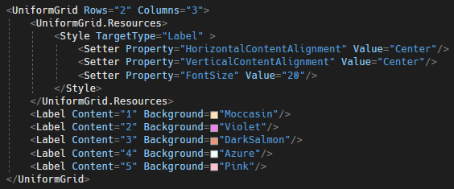
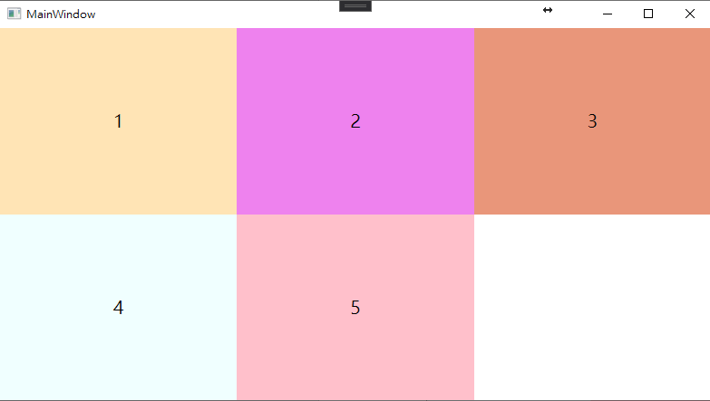
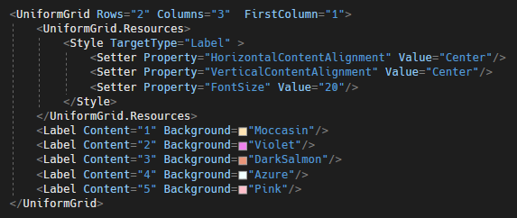
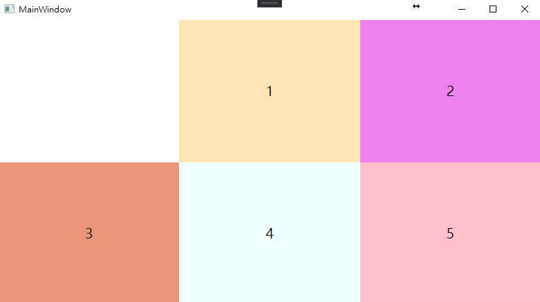

# WPF 使用 UniformGrid 平均分配行與列
一般在進行網格式排版時，會使用 Grid 容器，要使用 Grid必須預先指定 Grid
的 Grid.ColumnDefinitions 與 Grid.RowDefinitions
的屬性，然後指定子項目要放在 Grid
的哪一個位置；如果現在要使用平均分配行與列的方式，如果還要向上面那樣指定屬性，使用上會覺得不是那麼方便。最近發現有另外一個好用的容器
UniformGrid，只需指定 Rows 與 Columns
各自需要的數量，他就會自動將裡面的子元素進行平均分配。

UniformGrid 使用方法如下圖 1 所示：

圖 1、UniformGrid 使用

畫面顯示結果如下圖 2 所示：

圖 2、UniformGrid 顯示

另外也可以指定第一個元素的起始位置，使用 FirstColumn
屬性，就能夠指定要從第幾個 Column 開始，如下圖 3 所示：

圖 3、指定第一個元素的起始位置

結果如下圖 4 所示：

圖 4、結果呈現
