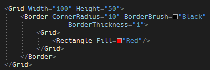
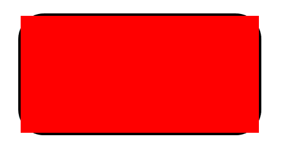
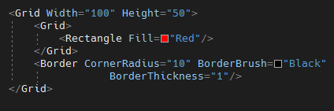
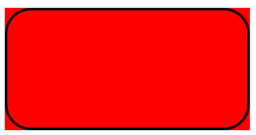
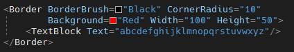
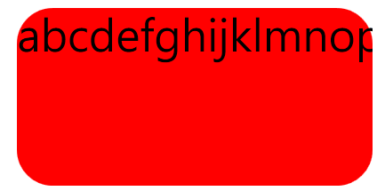
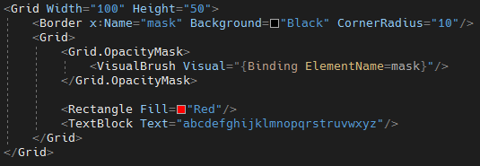
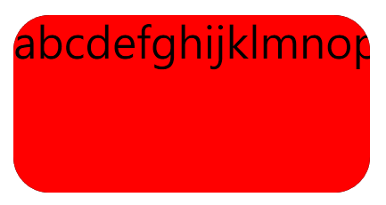

# WPF 圓弧容器

通常我們想要讓 WPF
的容器有圓弧的造型，往往調出來的結果就會是，裡面的內容物超出外層容器的樣子；本篇主要介紹如何透過
OpacityMask 的方式，來解決上述的問題。

首先，先來看看一般的做法，這邊會介紹原本三兩種圓弧邊界的作法，進入本篇所要介紹的主題項目。

**作法一：使用 Border 包覆內部元素**

下面的寫法的話，會導致導致包在 Border 裡面的項目大小只要超過 Border
的話，就會直接超出去，如下圖 1 所示：

圖1、Border 直接包含元素

**作法二：在元素的外面，在使用 Border 去覆蓋**

這次是在與內層元素同一階層的部分，在下方使用 Border
把邊界框出來，但是結果會與上面的做法一樣的狀況，結果如下圖 2 所示：

圖2、外層再使用 Border 覆蓋

**作法三：**

直接使用 Border
當作外部容器，但是這會有一個問題，只要裡面的元素一長的話，內容物還是會超出去，如下圖
3 中的字 p ，有超出一點點。

圖3、直接使用 Border 包含元素

再來就介紹本次的主角，OpacityMask
的方式，內容物即使有比較長，他還是會讓內容物被外層完整的包覆在容器中，不會讓他超出去。

圖4、使用 OpacityMask
