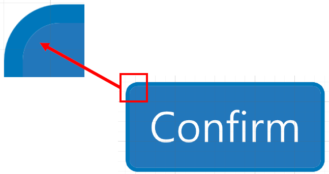
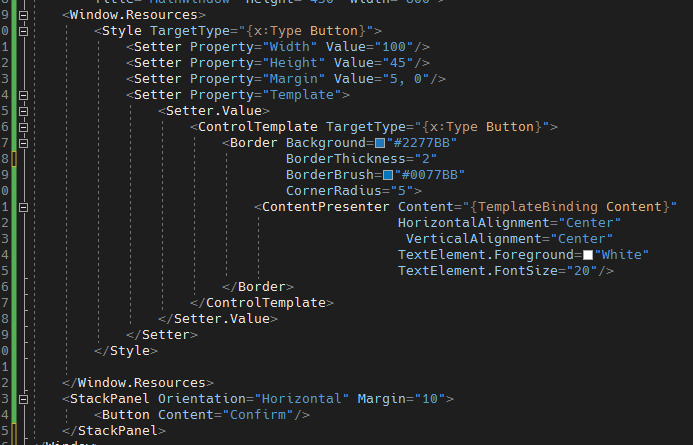
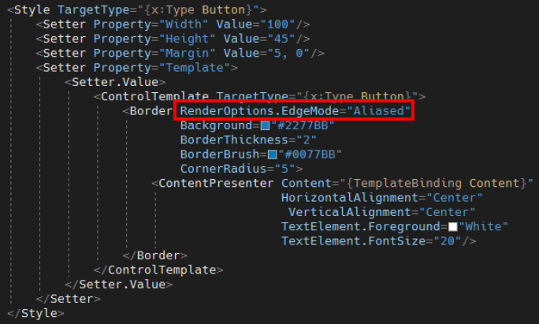
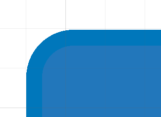

# WPF 圓角破圖問題修正
在設定 Button 圓角樣式的時候，可以發現在圓角的地方會有部分留有空白，導致看起來會有點醜醜的，畫面如下圖 1 所示：

圖 1、Button 圓角留有空白

Button 的 ControlTemplate 程式碼如下圖 2 所示：

圖 2、Button ControlTemplate Style

為了解決此問題，我們可以在 Border 的上面加上一個屬性，RenderOptions.EdgeMode="Aliased"，程式碼如下圖 3 所示：

圖 3、Border 加入 RenderOptions.EdgeMode="Aliased"

加入之後，就不會看到有空白的虛線了，如下圖 4 所示：

圖 4、修正圓角破圖問題

不過可以看到上圖中，圓角的地方有點鋸齒狀，這是因為 RenderOptoins.EdgeMode 是用來控制圖形呈現過程中的邊緣處理方式。

WPF使用了一種稱為向量圖形的方式來呈現圖形，它使用數學方程式描述圖形的形狀和屬性。然而，由於螢幕和顯示設備的物理限制，當圖形被呈現時，可能會出現鋸齒狀邊緣或模糊的情況。RenderOptions.EdgeMode 屬性就是用來解決這個問題的。

一般來說，WPF 中的 非文字控制項，是使用抗鋸齒狀的
(Unspecified)，這是一種較平滑的邊緣處理方式，它會使用額外的演算法來平滑圖形的邊緣，從而減少鋸齒狀邊緣的出現。所以會導致上面的圓角出現破圖。

若使用本篇介紹的設定方式
(Aliased)，這是一種簡單的邊緣處理方式，它會將圖形的邊緣直接顯示在螢幕上，不進行額外的處理。這可能會導致鋸齒狀的邊緣，特別是在圖形縮放或旋轉時。

**參考資料：**

<https://www.codeproject.com/Tips/752333/Improve-WPF-performance-with-RenderOptions>

<https://learn.microsoft.com/en-us/dotnet/api/system.windows.media.renderoptions.edgemode?view=windowsdesktop-7.0#system-windows-media-renderoptions-edgemode>

<https://learn.microsoft.com/en-us/dotnet/api/system.windows.media.edgemode?view=windowsdesktop-7.0>

<https://blog.51cto.com/u_15077551/4762332>
