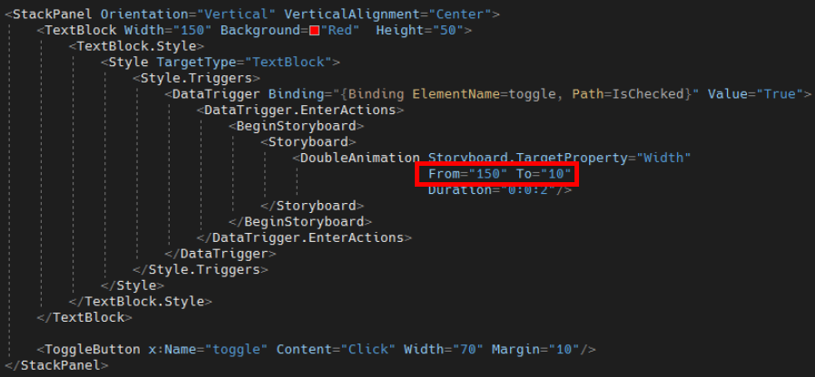
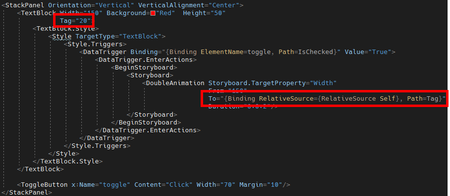
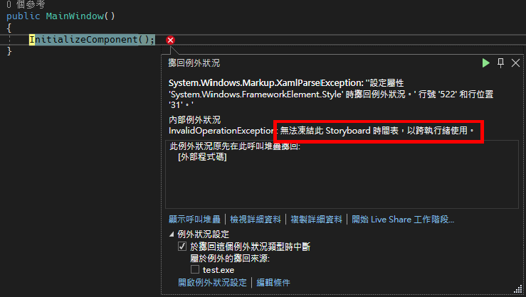
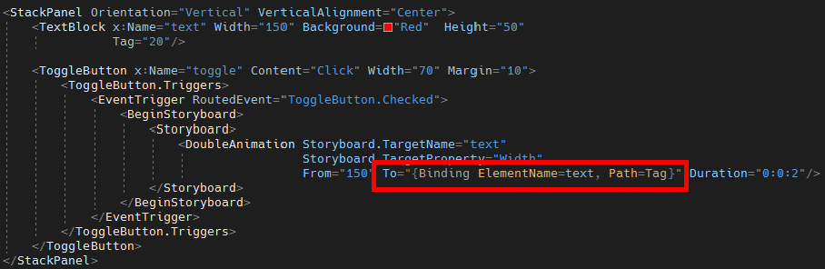
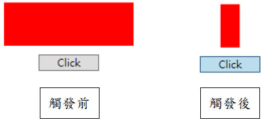

# WPF 在 DataTrigger 使用 Binding 到 To 屬性失敗解決辦法

在使用 Storyboard 時，可以指定動畫的 From 與 To 屬性，決定動畫起始與終點，程式碼如下圖 1 所示：

圖 1、設定動畫的 From 與 To 屬性

在上面範例程式碼中，TextBlock 的 Triggers 使用 DataTrigger 的方式進行觸發，它會根據 ToggleButton 控制項的 IsChecked 屬性為 True 的時候，觸發動畫，會將 TextBlock 的寬度從 150 變為 10。

現在當我讓 To 屬性綁定一個屬性值，假設將 To 屬性綁定到 TextBlock 屬性的 Tag 屬性，程式碼如下圖 2 所示：

圖 2、To 屬性綁定 TextBlock 本身的 Tag 屬性

此時，執行程式的時候，就會看到以下錯誤，畫面如下圖 3 所示：

圖 3、無法凍結此 Storyboard 時間表，以跨執行緒使用

研究了一個下午發現，不論怎麼寫就是沒有辦法解決此問題，最後變更做法為 EventTrigger 的寫法，才能夠順利觸發；透過在 ToggleButton 裡面設定 EventTrigger，並且在 DoubleAnimation 的地方指定 Storyboard.TargetName 為 TextBlock 的名稱 text，這樣一來就能夠在將資料綁定在 To 屬性上面，程式碼如下圖 4 所示：

圖 4、使用 EventTrigger 觸發動畫

動畫效果如下圖 5 所示：

圖 5、動畫效果
