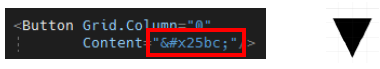
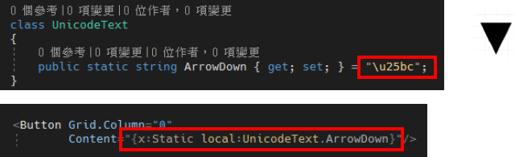
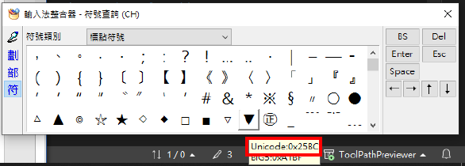

# WPF 在 XAML 中顯示 Unicode 符號

在 XAML 中如果要顯示 Unicode 符號，有一個特別的書寫方式，與在 C# 程式碼中宣告的方式不一樣，接下來將對這兩種寫法作介紹。

首先在 XAML 中，其書寫方式為 `&#x25bc;` 這樣子的書寫方式，這樣就能夠在畫面中顯示出來，我們的 Unicode 符號了，畫面如下圖 1 所示。

圖 1、XAML 中直接輸入 Unicode

若是在 C# 的 CodeBehind 就是要換成另外一種寫法，程式碼如下圖 2 所示：

圖 2、CodeBehind 定義 Unicode 字串

另外，這邊發現快速查詢 Unicode 的方法，在中文輸入法的情況下，按下 **Ctrl + Alt + 逗點**後，可以叫出輸入法整合器，滑鼠移動到任意符號的上方之後，可以看到該符號的 Unicode，如下圖 3 所示：

圖 3、輸入法整合器
