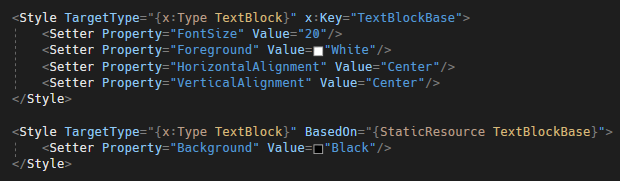
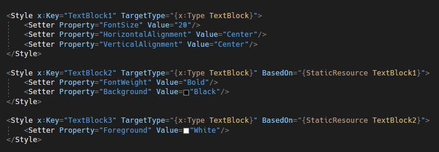
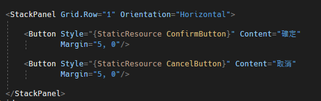
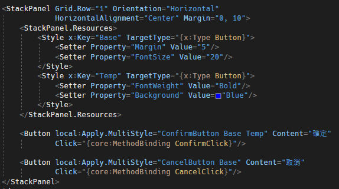

# WPF 多重樣式設定

WPF 的樣式與 CSS
類似，主要是將常用的屬性集合成一個樣式，方便的讓控制項進行套用；這麼做主要有兩個好處：1、統一樣式的風格；2、方便樣式的修改，只要修改一個地方全部有套用此樣式的控制項都會進行改變，不用再一個一個自行設定。

但是，在 WPF
中，每個控制項只能套用一個樣式，如果想要在控制項上面應用多個樣式，可以透過設定
BaseOn 的方式，依此 BaseOn 的樣式為基礎，在設定新的樣式上去，如下圖 1
所示。

圖1、基於另外一個樣式設定新的樣式

此設計可以解決大部分樣式設定的問題，不過因為 WPF
的特性，樣式只能垂直的基於 BaseOn 設定下去，就沒有辦法像是 CSS
那樣，一次套用多個樣式上去，導致樣式的組合性比較不佳；另外，對於相似樣式，但想要額外去統一設定屬性就不是那麼方便。

以下針對上面提到的兩個問題進行說明：

**垂直的 BaseOn 設定**

為了避免修改到之前套用在其他控制項上面的樣式，必須基於之前舊有的樣式，在新增一個新的樣式出來，導致程式碼變多也無法達到組合的效果，如下圖
2 所示：

圖 2、BaseOn 樣式垂直設定

**相似樣式，但想要額外去統一設定屬性就不是那麼方便**

像是有兩個類似的按鈕樣式，如果想要再另外統一控制這兩個樣式的間距，只能針對這兩個控制項去額外做設定，無法達到一次統一設定，如下圖
3 所示：

圖 3、額外分別設定 Margin 屬性

為了解決上述兩個問題，在 GitHub 上面看到了解決方法，可以讓 WPF
樣式，能夠像 CSS 那樣，指定多組樣式上去 (class="class1 class2 class3")。

他主要提供了兩種方式，第一種是透過 MarkupExtension
的方式，以及透過附加屬性的方式，這兩種方式實際測試起來，如果要看到樣式修改需要經過編譯才能看到透用之後的樣式，並不會即時的做修改；樣式的套用，後面的樣式會覆蓋掉前面的樣式。

使用了之後，針對上面提到的問題，就能夠完美的解決了，如下圖 4 所示：

圖 4、使用 Multi-Style for WPF

**參考資料：**

https://github.com/PxAndy/WpfMultiStyle

https://tw.coderbridge.com/questions/3802b80118284fb6971395d79ec6b3ae
