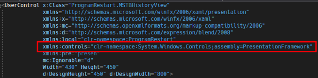
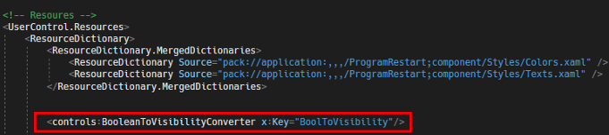
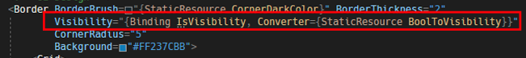

# WPF 如何使用內建的 BooleanToVisibilityConverter
## 前言
一直以來，都是在寫 WPF 時，都是自己寫布林值轉換 UI Visibility 屬性值的方法，最近發現原來 Microsoft 已經有提供此方法了。 

## 使用方法
此方法主要放在 PresentationFramework.dll 裡面，使用方法很簡單，只需要在 XAML 中引入指定的命名空間，就可以馬上使用，程式碼如下圖 1 所示：

圖 1、XAML 加入 PresentationFramework 的命名空間

> 這邊要注意一下，這段程式碼一定要自己打出來，沒辦法用 Visual Studio 內建的提示自動填滿。

然後就可以在 Resources 的地方引入，程式碼如下圖 2 所示： 

圖 2、Resource 中引入指定的 Converter

加入 Resource 之後，就可以使用此 Converter 了，程式碼如下圖 3 所示：

圖 3、使用 Converter

## 參考資料

[Msdn 連結](https://docs.microsoft.com/en-us/dotnet/api/system.windows.controls.booleantovisibilityconverter?view=netframework-4.0)