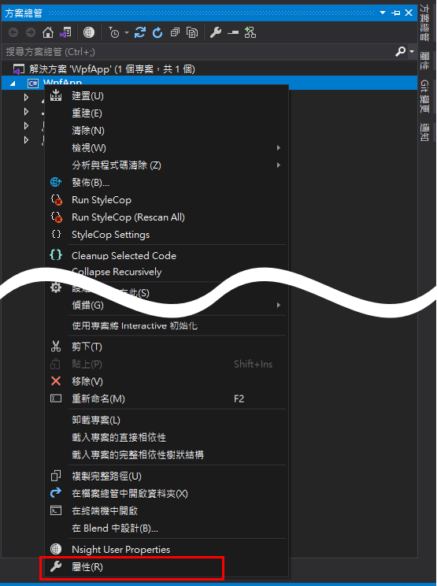
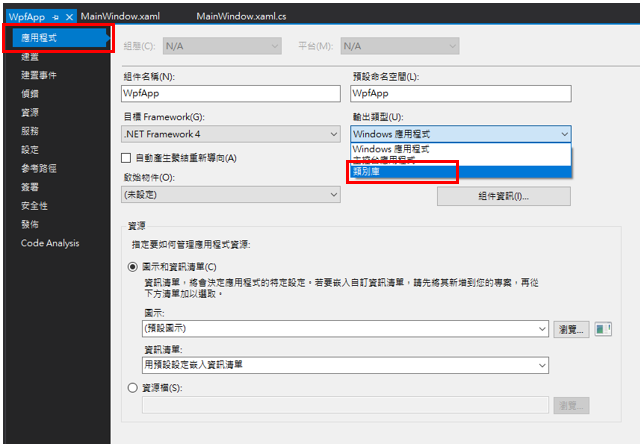
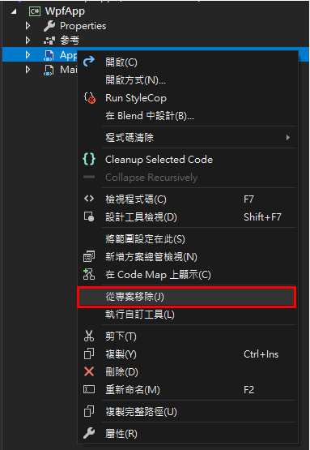

# WPF 應用程式轉為類別庫
假設原本專案使用應用程式的方式進行開發，但是，開發到一半發現，這個程式是要以類別庫的方式讓其他人參考使用，由於應用程式輸出的檔案類型，是 exe 檔案，並非 dll 檔案，無法讓其他專案引入參考。

此時有兩種做法：一、建立新的類別庫專案，並把所有的程式碼複製過去；二、直接將應用程式轉為類別庫。如果使用第一種方法，可能會碰到幾個問題，有參考其他 dll 檔案的需要重新參考、檔案複製不完全、需要修改命名空間、在修改命名空間的過程中，一不小心改到其他程式碼，導致程式無法順利執行，以上種種的問題。

為此，本篇將介紹第二種方式，快速地將應用程式轉換為類別庫。

首先，先對欲轉換為類別庫的專案點擊右鍵，找到屬性 (Properties)，如下圖 1 所示：

圖 1、開啟專案屬性

選擇應用程式標籤，裡面可以找到輸出類型，並將其改為類別庫，如下圖 2 所示：

圖 2、輸出類型改為類別庫

之後再將 App.xml 從專案中移除 (移除的好處是，之後還可以再加回來，變成應用程式)，如下圖 3 所示：

圖 3、從專案中移除 App.xaml 檔案

專案重新編譯過後，就會改以 dll 的格式輸出了，就能提供此 dll 給他人參考。
