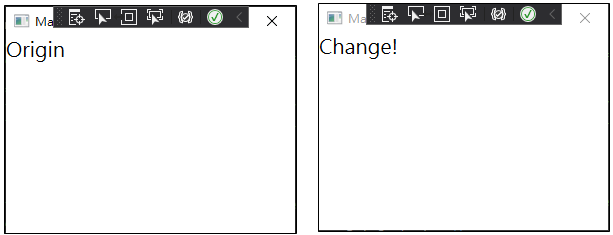
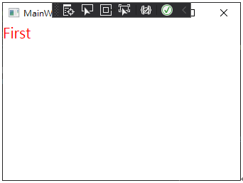
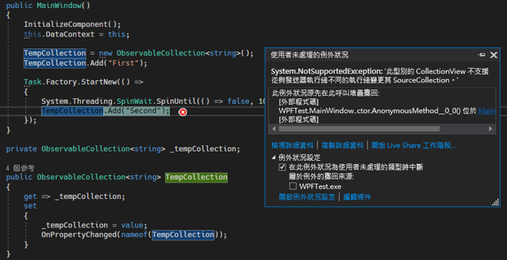

# **WPF 為甚麼 DataBinding 屬性進行通知時，可以不用跨執行續**

在寫 WPF 時，發現為什麼 DataBinding 的屬性，明明是屬於 UI 執行續的，但是在不同的執行緒上直接進行通知時，卻可以不用跨執行續將他跨回 UI。

上網查了一下發現，INotifyPropertyChanged 會從其他執行續直接跨回 UI 執行續，因此 PropertyChanged 事件不用在不同的執行續進行跨回 UI 執行續。

但是，這種通知只適用於常量的屬性 (ex. PropertyChanged 事件)。CollectionChangedNotification 則不會自動跨到 UI 執行續，必須自己要去跨回到 UI 執行續。這表示如果你從非 UI 執行續修改集合，將會得到一個例外錯誤。

 **情況一：** 一般常量的屬性，跨執行續進行屬性通知，程式碼如下所示：

XAML：

```xml
<TextBlock Text="{Binding UpdateString}"/>
```

ViewModel:
```cs
private string _updateString = "Origin";
public string UpdateString {
  get => _updateString;
  set {
    _updateString = value;
    OnPropertyChanged(nameof(UpdateString));
  }
}
```

跨執行續改變數值

```cs
Task.Factory.StartNew(() => {
  System.Threading.SpinWait.SpinUntil(() => false, 5000);
  
  UpdateString = "Change!";
});
```

執行結果，成功改變



**情況二：**跨執行續讓 ObservableCollection 進行屬性通知，就會有例外產生，程式碼如下所示：

XAML：
```xml
<ItemsControl ItemsSource="{Binding TempCOllection}">
   <ItemsControl.ItemsPanel>
      <ItemsPaneItemplate>
         <StackPanel Orientation="Vertical"/> 
     </ItemsPanelTempIate>
   </ItemsControl.ItemsPanel>
   <ItemsControl.ItemTemplate>
      <DataTemplate>
         <TextBlock Text="{Binding}" Foreground="Red" FontSize="20"/>
     </DataTemplate>
   </ItemsControl.ItemTemplate>
</ItemsControl>
```
ViewModel：

```cs
private ObservableCollection<string> _tempCollection;
public ObservableCollection<string> TempCollection {
  get => _tempCollection;
  set {
    _tempCollection = value;
    _tempCoIIectionOnPropertyChanged(nameof(TempCollection));
  }
}
```

跨執行續增加 ObservableCollection 的值

```cs
public MainWindow() {
  InitializeComponent();
  this.DataContext = this;

  TempCollection = new ObservabIeCollection<string>();
  TempCollection.Add("First");
  
  Task.Factory.StartNew(()=> {
    System.Threading.SpinWait.SpinUntiI(()=> false, 10000);
    TempCollection.Add("Second");
  });
}
```
執行結果出錯：



