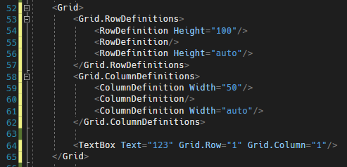
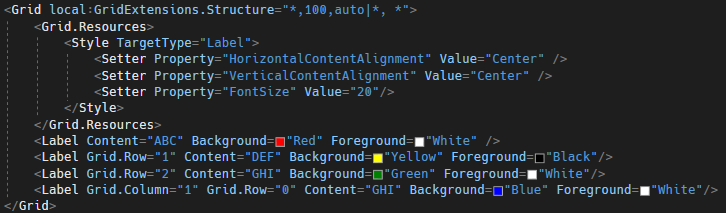
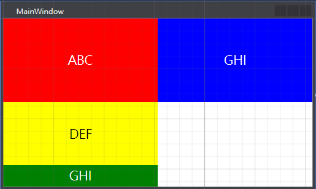
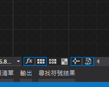

# WPF 縮寫 Grid ColumnDefinition 與 RowDefinition 方法

在 WPF 排版面的時候，Grid
是一個強大的排版控制項，其概念為以表格的形式排版裡面的元素，將子控制項放在一個事先定義好的網格內。Grid
控制項算是在開發過程中，最常使用的排版方式。

不過在每次使用的過程中，要先定義 Column 與
Row，每次定義的時候都要打很多程式碼，如下圖 1 所示：

圖 1、Grid Row 與 Column 定義

找了一下解決辦法，發現有人也有相同的煩惱，並且將其作成依賴屬性，搭配縮寫的
Colum 與 Row 方法，詳閱參考資料
1，減少撰寫大量定義的程式碼，程式碼如下圖 2 所示：

圖 2、GridExtension 套用

設定完成之後，畫面結果預覽，畫面如下圖 3 所示：

圖 3、畫面結果預覽

GridExtensions.Structure 裡面的程式碼，以 \| 做為區隔前面是 Row
的定義，後面是 Column 的定義，並且 RowDefieintion 的值使用 ,
分開，程式碼看起來清爽許多。

在定義的時候要記得 Grow 與 Row 都要寫出來 \*\|\*，不然無法正常呈現。

另外，在 XAML
設計的地方，如果沒有辦法呈現即時的設計畫面，有可能是因為下方的啟用專案程式碼被取消掉了，只要重新開啟就能夠立即看到即時的設計畫面，按鈕位置如下圖
4 所示：

圖 4、啟用專案程式碼

**參考資料：**

1.  <https://github.com/thomasclaudiushuber/Wpf-Grid-Extensions/blob/main/WPFGridExtensions/GridExtensions.cs>

2.  <https://stackoverflow.com/questions/9535812/is-there-any-shorthand-for-wpf-column-and-row-definitions>
