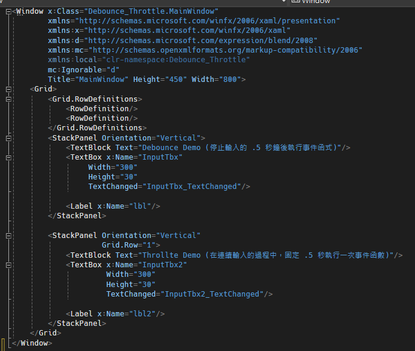
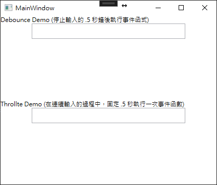

# WPF 防抖與節流

防抖 (Debounce) 與節流 (Throttle) 主要是用來防止事件被頻繁觸發的方法。一個簡單的例子就是，當使用者在對輸入框輸入文字的時候，會頻繁觸法 TextChanged 的事件，但其實對於 TextChanged 事件來說，其實真正重要的是在使用者輸入完畢之後的 Text 值才需要做事情，此時，重複的事件觸發就會導致效率下降。

接下來說明防抖與節流是甚麼東西

1. 防抖
   說明：是指當事件觸發時，他會等到事件停止觸發的一段時間之後，他才會去執行一次事件處裡函式。如果再等待的時間內事件再被觸發，那等待的時間就會重新計算。
   範例：使用者在對輸入框打字的時候，會觸發輸入事件，使用防抖，讓我們能夠在使用者停止輸入的一段時間之後，才發送查詢語法，避免每次輸入一個字就被出發一次
2. 節流
   說明：節流是一種控制函式呼叫頻率的方法。當你對某個事件進行節流的時候，不論該事件觸發多少次，他都會在指定的時間間隔內只執行一次該函式的處理函式。
   範例：假設有一個隨著滑鼠移動而更新的 UI，你不希望她每次滑鼠移動的時候都進行更新，因此可以設定每隔一段時間才更新一次。

先來看 Debounce 的程式碼，裡面可以看到在建構子的地方，使用者需要指定時間間隔以及要執行的函式；Signal 方法是放在事件處理函式裡面，每次當事件觸發的時候，呼叫此事件，他會先將裡面的 timer 給暫停，然後重新啟動，此時指定的方法就要等到時間間隔到達後才會執行裡面的函式，程式碼如下所示：

```cs
class Debounce 
{
  private Dispatcher _dispatcher;
  private Action _action;
  
  public Debounce(TimeSpan interval, Action action) 
  {
    this._action = action;
  
    timer = new DispatcherTimer();
    timer.Interval = interval;
    timer.Tick += (sender, args) => {
      _action();
      timer.Start();
    }
  }
  
  public void Signal() 
  {
    timer.Stop();
    timer.Start();
  }
}
```

定義好 Debounce 類別之後，我們能在 MainWindow.cs 檔案中將此類別 new 出來，並且指定每次觸發的時間，下面可以看到 InputTbx_TextChanged 的事件，在每一次有事件觸發的時候，會去呼叫 debounce.Signal() 方法，重新計算觸發裡面方法的時間，程式碼如下所示：

```cs
public partial class MainWindow : Window
{
    private Debounce debounce;

    public MainWindow()
    {
        InitializeComponent();
        debounce = new Debounce(TimeSpan.FromSeconds(.5), DebouncedAction);
    }

    private void InputTbx_TextChanged(object sender, TextChangedEventArgs e)
    {
        debounce.Signal();
    }

    private void DebouncedAction()
    {
        lbl.Content = InputTbx.Text + " !!!";
    }
}
```

接下來看 Throttle 類別程式碼，在建構子的地方給定時間間隔的參數，以及要呼叫的事件；Signal 方法是放在事件處理函式裡面，當事件觸發的時候，呼叫此方法裡面會判斷 timer 是否有被啟動了，若有啟動他會等到指定的時間間隔到達，執行指定的方法；如果還沒有，會讓 timer 開始執行，並等到指定的時間間隔，執行裡面的方法，程式碼如下所示：

```cs
 class Throttle
 {
     private DispatcherTimer _timer;
     private Action _action;

     public Throttle(TimeSpan interval, Action action)
     {
         this._action = action;
         _timer = new DispatcherTimer();
         _timer.Interval = interval;
         _timer.Tick += (s, e) =>
         {
             _action();
             _timer.Stop();
         };
     }

     public void Signal()
     {
         if (!_timer.IsEnabled)
         {
             _timer.Start();
         }
     }
 }
```

定義好 Throttle 類別之後，我們能在 MainWindow.cs 檔案中將此類別 new 出來，每次觸發 InputTbx2_TextChanged事件的時候，會去呼叫 throttle.Signal() 方法，如果 timer 還沒有啟動，他就會啟動 timer，如果 timer 有啟動了，就不另外做事情，等到 timer 時間一到就做指定的方法，程式碼如下所示：

```cs
public partial class MainWindow : Window
{
    private Throttle throttle;

    public MainWindow()
    {
        InitializeComponent();
        throttle = new Throttle(TimeSpan.FromSeconds(.5), ThrottledAction);
    }

    private void InputTbx2_TextChanged(object sender, TextChangedEventArgs e)
    {
        throttle.Signal();
    }

    private void ThrottledAction()
    {
        lbl2.Content = InputTbx2.Text.Count().ToString();
    }
}
```

UI 程式碼:



執行畫面


