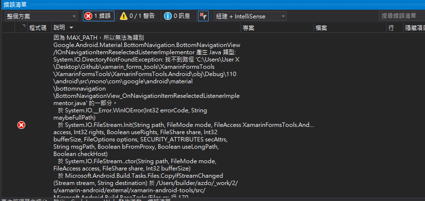
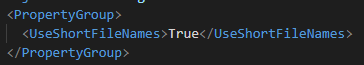
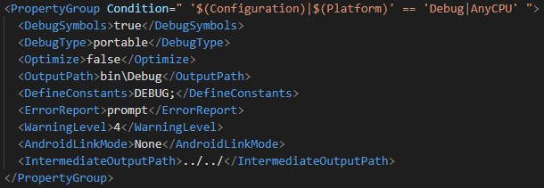

# Xamarin.Android 編譯時，路徑過長解決辦法

Visual Studio 要執行 Xamain.Android 的專案編譯時，結果跳出路徑過長的錯誤，如下圖 1 所示：

圖 1、MAX_PATH

主要是因為有最大路徑長度的限制 260
個字元的關係，所以才會無法順利編譯成功，為了解決這個問題，主要提供三種解決辦法：

1. 將專案資料夾，離 C 槽近一點或是把專案名稱命短一些

因為路徑層級比較多，導致超出規定的長度，只需將路徑離 C 槽靠近一點即可

或是將專案命名短一些，來讓路徑不會顯得那麼長

2. 在 Android 專案底下的 .csproj 檔案中加入

UseShortFileNames 預設是 False，可以將其設定為
True，來解決此問題，實際試過效果不大，設定如下圖 2 所示：

圖 2、加入 UseShortFileNames 規則

3.  在 Android 專案底下的 .csproj 檔案中加入

\<IntermediateOutputPath\>指定一個想要的路徑\</IntermediateOutputPath\>

設定如下圖 3所示：

圖 3、指定目標路徑
