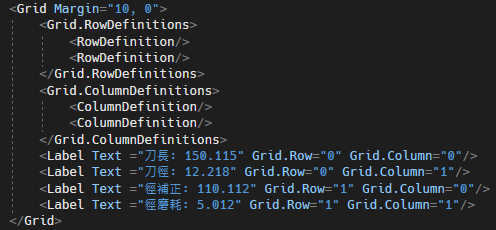
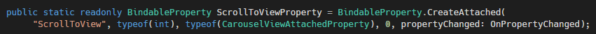
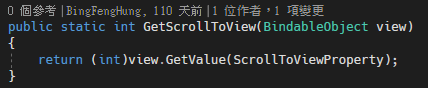
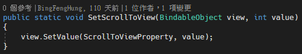
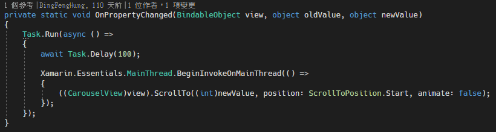
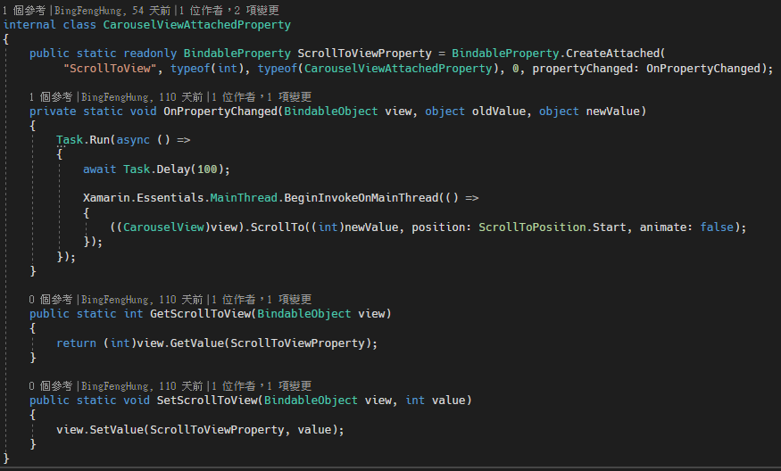
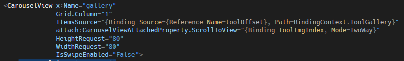

# Xamarin.Forms Attached Properties 附加屬性

附加屬性是一種特殊的 BindableProperty，他可以掛載到 XAML
中某一個物件上面，讓該物件擁有這個屬性。例如，子元素可以使用附加屬性來告知他的父元素他們要如何被呈現在畫面上，如下圖
1 所示：

圖 1、Grid 子元素

附加屬性實作的情境如下：

\- 當需要一個屬性設定機制，但是該類別並未具有此屬性。

\- 當類別表示為一個服務，其需要更容易地整合到其他類別中。

建立附加屬性的流程如下：

1\. 使用 BindableProperty.CreateAttached
多載方法中的其中一個，以此來建立 BindableProperty 實例。

2\. 提供 static Get PropertyName 與 Set PropertyName
作為附加屬性的存取器。

要建立用於其他類型的附加屬性時，建立附加屬性的類別並不需要繼承至
BindableObject。但是，存取器的目標屬性必須繼承至 BindableObject。

附加屬性的命名慣例為，附加屬性識別碼必須要是 CreateAttached
方法定義的屬性名稱再加上 Property
跟在後面，以此來作為識別碼，建立方式如下圖 2 所示：

圖2、建立附加屬性

上面程式碼建立了一個名為 ScrollToViewProperty
的附加屬性名稱，編譯器上的顯示名稱為 ScrollToView，型別為 int，是在
CarouselViewAttachedProperty 的類別裡面，預設值為 0，並且包含一個
propertyChanged 的方法。

再來需要建立存取器，靜態 Get 屬性名稱與 靜態 Set
屬性名稱方法，需要作為附加屬性的存取器，否則屬性系統無法使用附加屬性。

Get屬性名稱存取器程式碼，如下圖 3 程式碼所示：

圖3、Get 屬性名稱存取器建立

Get屬性名稱存取器必須返回存在相關 BindableProperty 欄位的附加屬性的值。
透過呼叫 GetValue 方法，並將 BindableProperty
傳入到該方法中，來取得其值，並且將該值轉形成需要的類型，並回傳轉型後的值。

Set屬性名稱存取器程式碼，如下圖 4 程式碼所示：

圖4、Set 屬性名稱存取器建立

Set屬性名稱存取器將值設定到對應的 BindableProperty 的附加屬性欄位。
並且透過 SetValue
方法，傳入可綁定屬性識別碼，以及預設定的值，以此來進行值的設定。

※兩個存取器，其目標物件必須或是繼承至 BindableObject。

再來裡面有一個還有一個
propertyChanged的事件，這個方法主要是用來當屬性值改變時，需要做甚麼樣的處理，這些處理方式就是寫在這裡面，程式碼如下圖
5 所示。

圖5、OnPropertyChanged

這邊就是當我的屬性值改變時，指定我的 CarouselView 去 Scrolll 到第幾頁。

完整程式碼如下圖 6 所示：

圖 6、附加屬性完整程式碼

完成上面的建立之後，就可以把該屬性附加到 CarouselView 上面，如下圖 7
所示：

圖7、加入附加屬性
